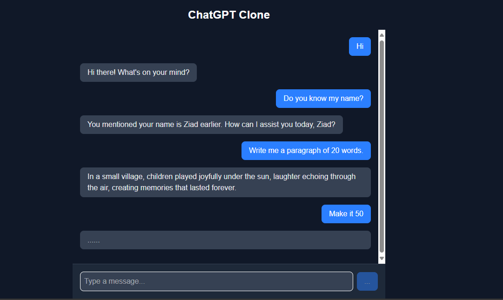

# ChatGPT Clone – AI Chat App 🤖💬

This is the main guide repository that provides documentation and links to the ChatGPT clone project. The project mimics OpenAI's ChatGPT flow using Next.js (Frontend) and NestJS (Backend) with OpenAI API integration.



## 🔗 Project Repositories

| Repo | Description | Link |
|------|-------------|------|
| **Backend** | NestJS backend that handles OpenAI API requests | [chatgpt-clone-backend](https://github.com/ZiadGamalDev/chatgpt-clone-backend) |
| **Frontend** | Next.js frontend with modern UI for chatting | [chatgpt-clone-frontend](https://github.com/ZiadGamalDev/chatgpt-clone-frontend) |

## 🧠 Features

- Chat interface for AI conversations
- User input chat box (no login needed)
- Backend powered by NestJS
- Frontend built with Next.js for server-side rendering
- Sends real-time requests to OpenAI's GPT
- Displays AI responses smoothly
- Serverless-friendly frontend deployment
- API integration for AI responses

## 🚀 Deployed Links

- Frontend: [chatgpt-clone-frontend](https://chatgpt-clone-frontend-alpha.vercel.app/)
- Backend: [chatgpt-clone-backend](https://chatgpt-clone-backend-production.up.railway.app/)

## 🛠️ Tech Stack

- **Frontend:** Next.js 14, TypeScript, TailwindCSS
- **Backend:** NestJS, OpenAI SDK

## 🚀 Quick Start

To set up this project locally, you'll need to clone both repositories:

### Backend Setup
```bash
git clone https://github.com/ZiadGamalDev/chatgpt-clone-backend.git
cd chatgpt-clone-backend
npm install
# Create .env file with your OPENAI_API_KEY
npm run start
```

### Frontend Setup  
```bash
git clone https://github.com/ZiadGamalDev/chatgpt-clone-frontend.git
cd chatgpt-clone-frontend
npm install
# Create .env.local file with NEXT_PUBLIC_BACKEND_URL
npm run dev
```

## 📝 Development Notes

This guide repository serves as documentation and project overview. The actual source code is maintained in separate repositories to avoid duplication and maintain clean project structure.

## License

This project is licensed under the MIT License.